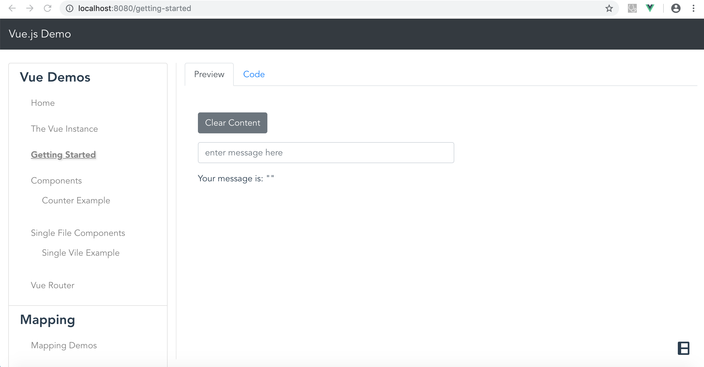

# vue-js-demo

## Project setup

### Important! Create the following "config.json" file in `public` folder before attempting to run this app:

```json
{
  "github_graphql_token": null,
  "mapbox_token": null,
  "stargazers": [
    {
      "repo": "vue",
      "owner": "vuejs"
    }, {
      "repo": "react",
      "owner": "facebook"
    }, {
      "repo": "angular",
      "owner": "angular"
    }, {
      "repo": "ember.js", 
      "owner": "emberjs"
    }
  ]
}

```

> Note: The above `config.json` file is intentially left out of this repository because it contains some of my personal access tokens.  You must create this to make the app work.

#### set up mapbox token
make sure you set the `mapbox_token` property with your own mapbox token. To create a mapbox token, follow the steps outlined below:

[https://docs.mapbox.com/help/tutorials/get-started-tokens-api/](https://docs.mapbox.com/help/tutorials/get-started-tokens-api/)

#### set up github graphql token

Follow the steps outlined in the link below to create a github `graphql` access token, and then set that in the config:

[https://developer.github.com/v4/guides/forming-calls/#authenticating-with-graphql](https://developer.github.com/v4/guides/forming-calls/#authenticating-with-graphql)

## now install dependencies

```
npm install
```

### Compiles and hot-reloads for development
```
npm run serve
```

### Compiles and minifies for production
```
npm run build
```

### Lints and fixes files
```
npm run lint
```

### The Sample Application

this application is designed to demonstrate simple vue concepts.  It has links to documentation and shows previews of vue functionality along with code examples.

#### home page


#### help guides


#### functionality preview



#### code preview


